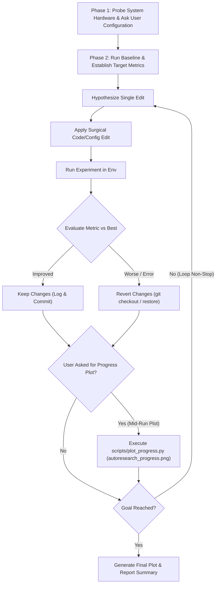

# Autoresearch: Autonomous AI Dev & Research Loop

## Overview

**Autoresearch** is an autonomous experiment loop based on Andrej Karpathy's `autoresearch` concept, generalized for AI engineering, machine learning development, LLM fine-tuning, prompt tuning, architecture exploration, hyperparameter search, and code optimization.

The core principle is simple: **Formulate hypothesis → Apply surgical edit → Run in environment → Evaluate metric → Keep if improved (commit/log), revert if degraded → Repeat autonomously non-stop until reaching target goal.**

---

## Workflow Overview



---

## Phase 1: Environment Discovery & User Onboarding

When this skill is activated, perform hardware self-discovery first, then ask the user the three required onboarding questions before starting any experiments.

### Step 1.1: System & Hardware Auto-Discovery (Self-Executed)

Silently inspect the system environment to determine hardware acceleration and OS capabilities:

- **NVIDIA GPU**: Run `nvidia-smi` (check CUDA version, VRAM, GPU model e.g., RTX 4090, H100).
- **AMD GPU**: Run `rocm-smi` or `clinfo` (check ROCm / HIP support).
- **Apple Silicon (MPS)**: Run `sysctl -n machdep.cpu.brand_string` and check `python3 -c "import torch; print(torch.backends.mps.is_available())"`.
- **CPU / OS**: Check OS (`uname -s`), CPU architecture, available cores, and RAM.

*Document auto-detected hardware silently to customize run commands and batch sizes.*

---

### Step 1.2: Interactive User Questions

Prompt the user for the following 3 configuration parameters:

#### Question 1: Task, Goal, & Solution POV
> *"What are we working on? Please describe:"*
> 1. **Task & Problem Statement**: What is the model type, dataset, or problem area?
> 2. **Target Goal / Metric**: What metric are we optimizing? (e.g., `val_loss < 1.2`, `accuracy > 0.85`, `throughput > 500 tok/s`, `latency < 50ms`). Direction: Is lower better or higher better?
> 3. **User Solution / Hypotheses**: Do you already have specific ideas, solutions, or POVs you want me to test first, or should I generate hypotheses autonomously?

#### Question 2: Experiment Tracking Strategy
> *"How would you like to track experiment iterations?"*
> - **Option A (Git Commits)**: Auto-commit on improvement (`git commit -m "exp: improved loss to 1.34"`), auto-revert on failure (`git checkout .` / `git reset`).
> - **Option B (Markdown Experiment Log)**: Append every iteration's hypothesis, diff, metric, and outcome to `experiment_log.md`.
> - **Option C (Hybrid - Recommended)**: Both Git auto-commit/revert AND Markdown `experiment_log.md` logging.

#### Question 3: Environment Manager & Run Command
> *"What environment manager and execution command should be used?"*
> - **Environment Manager**: e.g., `conda`, `uv`, `venv`, `poetry`, `pixi`, `docker`, or direct system python.
> - **Run Command**: The exact command to run training/evaluation (e.g., `uv run python train.py`, `conda run -n myenv python main.py --eval`, `pytest bench/`).

---

## Phase 2: Baseline Establishment & Log Setup

1. **Verify Baseline Code**: Ensure the codebase has a working evaluation loop or training script that outputs an explicit numerical metric.
2. **Execute Baseline Run**: Execute the specified run command.
3. **Record Initial Metrics**: Extract baseline performance (e.g., `baseline_loss = 2.45`, `baseline_speed = 120 samples/s`).
4. **Initialize Experiment Logs**:
   - Create `experiment_log.md` for human readability.
   - Create `experiment_log.json` for machine-readable plot generation.

```markdown
# Experiment Log: [Task Name]

- **Date**: [Timestamp]
- **Hardware**: [Detected GPU / CPU]
- **Environment**: [User Env Manager & Command]
- **Target Metric**: [Target Value]
- **Baseline Metric**: [Initial Value]

| Exp # | Hypothesis / Change | Metric | Delta | Outcome | Notes |
|-------|--------------------|--------|-------|---------|-------|
| 000   | Baseline           | 2.45   | 0.00  | KEEP    | Initial state |
```

`experiment_log.json` structure:
```json
[
  {
    "exp_num": 0,
    "hypothesis": "baseline",
    "metric": 2.45,
    "outcome": "KEEP",
    "notes": "Baseline run"
  }
]
```

---

## Phase 3: Non-Stop Autonomous Experiment Loop

Once onboarding is complete and the baseline is established, **the agent MUST loop non-stop** through the following sub-steps without pausing or asking the user for confirmation between iterations.

### Step 3.1: Formulate Hypothesis
Select a single, isolated variable to modify. Examples:
- **Hyperparameters**: Learning rate, batch size, weight decay, optimizer schedule, warmup steps.
- **Architecture**: Layer count, attention heads, activation functions, normalization layers, positional encodings.
- **Loss & Data**: Loss weighting, data augmentation, truncation length, tokenization rules.
- **Prompts / RAG**: System prompt tweaks, few-shot examples, context window sizing.
- **Code Optimization**: Vectorization, kernel compilation (`torch.compile`), mixed precision (`amp/fp16/bf16`), caching.

*Rule: Change ONE conceptual variable per experiment so improvements or regressions can be cleanly attributed.*

### Step 3.2: Apply Surgical Edit
- Modify the targeted file(s) with minimal, surgical diffs.
- Keep modifications focused and easy to revert.

### Step 3.3: Execute Experiment
- Run the user's execution command using `run_command` in the appropriate environment context.
- Capture stdout, stderr, and run duration.
- Enforce timeout limits if a run hangs or exceeds expected execution time.

### Step 3.4: Evaluate Metric & Decide

Compare new result metric $M_{\text{new}}$ against best metric $M_{\text{best}}$:

#### Case A: Metric Improved ($M_{\text{new}} \text{ better than } M_{\text{best}}$)
1. Update best metric: $M_{\text{best}} \leftarrow M_{\text{new}}$.
2. Append entry to `experiment_log.md` and `experiment_log.json` with outcome `"KEEP"`.
3. If Git tracking active: `git add . && git commit -m "exp[N]: [hypothesis] - metric improved to [M_new]"`.
4. Formulate next hypothesis building on this win.

#### Case B: Metric Degraded or Crashed ($M_{\text{new}} \text{ worse or runtime error}$)
1. Append entry to `experiment_log.md` and `experiment_log.json` with outcome `"REVERT"` and error/failure reason.
2. If Git tracking active: `git checkout -- .` (or restore modified files).
3. If non-git tracking: Restore original file content from pre-edit state.
4. Formulate alternative hypothesis from original baseline state.

---

## Progress Graph Visualization (`scripts/plot_progress.py`)

Generate Karpathy's progress plot using the helper script `scripts/plot_progress.py`:

```bash
python <path_to_skill>/scripts/plot_progress.py --log experiment_log.json --out autoresearch_progress.png
```

Add `--higher-is-better` if the optimization metric is higher-is-better.

### Execution Triggers:
1. **On-Demand Mid-Run**: Whenever the user asks for progress during an active loop (e.g. *"Show progress plot"* or *"How is it going?"*).
2. **Loop Completion**: Automatically when the experiment ends.

---

## Loop Termination & Final Reporting

The loop continues automatically **NON-STOP** until one of the following conditions is met:

1. **Goal Achieved**: Metric reaches or exceeds user's target goal.
2. **Convergence / Diminishing Returns**: N consecutive experiments (e.g. 5 iterations) yield no further improvement.
3. **Budget Limit**: Reached max iteration count specified by user or system resource limits.

When stopping:
1. Run `python <path_to_skill>/scripts/plot_progress.py` to generate the final `autoresearch_progress.png`.
2. Embed the plot in the final walkthrough/summary report (``).
3. Provide a clear text summary of baseline vs final metric, total runs, kept count, and top improvements.
