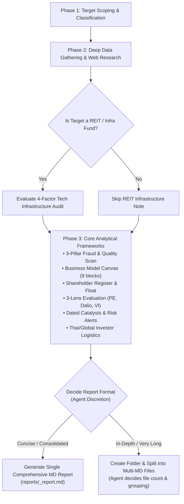

# Company Research Blueprint Skill

## Overview

This skill executes an institutional-grade, multi-lens fundamental analysis of any public company, business, or Real Estate Investment Trust (REIT) for investment decision-making.

It combines quantitative forensic accounting (**3-Pillar Financial Scan for fraud/earnings quality**), structural business modeling (**Business Model Canvas & Shareholder Analysis**), deep strategic synthesis (**3 Investment Lenses: Private Equity, Ray Dalio Macro, Value Investing**), conditional technical audits (**REIT / Data Center tech durability**), and practical investor execution (**cross-border tax, Section 41 repatriation, estate tax, broker fees, and Thai mutual fund exposure**).

The complete Thai reporting structure and all evaluation tables live in [`references/blueprint-template.md`](references/blueprint-template.md).

---

## Workflow & Research Pipeline

---

## Step-by-Step Execution Guide

### Phase 1: Target Scoping & Intake

1. **Target Identification**: Identify company name, ticker symbol, primary stock exchange (SET, NYSE, NASDAQ, SGX, HKEX, etc.), sector, and reporting currency.
2. **Asset Classification**: Determine whether the target is:
   - **Operating Company**: General corporate business (Tech, Manufacturing, Retail, Energy, etc.).
   - **REIT / Infrastructure Trust / Data Center Asset**: Real estate, infrastructure fund, or colocation/data center trust.
3. **Language Preference**: Generate the report in Thai by default (matching the terminology in `references/blueprint-template.md`), or in English if requested.

---

### Phase 2: Data Gathering & Web Research

Conduct multi-source research using financial filings, investor relations materials, and market data:
- **Price & Trading**: Current stock price, market cap, and daily closing prices over the past 30 days.
- **Financial Statements**: 5 to 10 years of historical income statements, balance sheets, cash flow statements, and dividend history.
- **Corporate Filings**: Latest Annual Report / Form 10-K, latest 10-Q / interim reports, investor presentations, and earnings call transcripts.
- **Ownership**: Major shareholders, institutional holdings (PE, Sovereign Wealth, Mutual Funds), founder/insider stakes, and free float %.
- **Recent Developments**: News, customer contracts, M&A, regulatory matters, management changes, and industry tailwinds/headwinds with dated sources.

---

### Phase 3: Analytical Frameworks

#### 1. 3-Pillar Financial Scan (Fraud & Earnings Quality Detection)
- **Pillar 1: Revenue & Accruals Quality**:
  - Compare Days Sales Outstanding (DSO) growth against revenue growth (DSO spiking faster than revenue suggests channel stuffing or premature revenue recognition).
  - Check for abnormal unbilled receivables or excessive capitalization of operating expenses/R&D.
- **Pillar 2: Operating Cash Flow vs Net Income Divergence**:
  - Verify whether Net Income growth is backed by cash (CFO vs Net Income ratio). A growing divergence is a classic red flag for low-quality earnings.
  - Assess Free Cash Flow (CFO - Capex) stability and dividend coverage safety.
- **Pillar 3: Balance Sheet Health & Contingent Liabilities**:
  - Evaluate goodwill and intangible asset bloat relative to total equity (impairment risk).
  - Check debt maturity wall, interest coverage ratio (EBIT / Interest), and floating vs fixed debt exposure.
  - Review auditor tenure, qualifications, or recent auditor changes.

#### 2. Conditional REIT / Data Center Infrastructure Audit (`Note: เฉพาะบริษัทหรือกอง REIT`)
> [!IMPORTANT]
> **Conditional Rule:**
> - **If the target is a REIT, Infrastructure Trust, or Data Center operator**: Evaluate the 4 factors below to ensure assets are durable against technological obsolescence and ready for AI workloads.
> - **If the target is a standard operating company**: **Skip this section entirely.** Do not force infrastructure checks onto non-REIT businesses.

**The 4 Durability Factors:**
1. **Structural Readiness (สเปกโครงสร้างพื้นฐาน):**
   - Floor loading capacity $\ge 1,500 - 2,000\text{ kg/m}^2$ for high-density compute/AI server racks.
   - Slab-to-slab clear height sufficient for liquid cooling manifolds, CDUs, and overhead busways.
2. **Power Headroom / MW Allocation (โควตาไฟฟ้าสำรอง):**
   - Secured power reservation with utility substations (Secured Utility Substation Capacity) for expansion.
   - Dual-feed power redundancy and backup generator support.
3. **Carrier-Neutral Network Hub / Edge Density (ทำเลจุดเชื่อมต่อโครงข่าย):**
   - Interconnection density at key intersections of subsea cables or terrestrial fiber backbones (Routing Hub status).
4. **Active Capital Recycling by Sponsor (การหมุนเวียนสินทรัพย์ของ Sponsor):**
   - Track record of sponsor developing modern AI-ready assets to drop down into the trust, while actively divesting aging/obsolete facilities.

#### 3. Business Model Canvas (BMC)
Deconstruct all 9 building blocks with deep product/customer focus: Customer Segments, Value Propositions, Channels, Customer Relationships, Revenue Streams, Key Resources, Key Activities, Key Partnerships, and Cost Structure. Incorporate any recent M&A impact.

#### 4. Shareholding Structure & Alignment
Map major shareholders, ownership %, investor type (Founder, PE, Mutual Fund, VI), free float %, activist presence, founder control, and note whether shareholders hold stakes in competitors.

#### 5. 3-Lens Strategic Evaluation
- **Private Equity (PE) Agency**: Control & catalyst, operational/cost trimming via BMC, cash flow & LBO debt capacity, 3-5 year exit strategy.
- **Ray Dalio (Macro Hedge Fund)**: Macro cycle sensitivity (inflation, rate shifts), debt cycle position, portfolio fit/correlation.
- **Value Investing (VI Style)**: Economic moat (network effect, switching cost, cost advantage, patents), management alignment (skin in the game), margin of safety against conservative intrinsic value.

#### 6. Comparison Matrix & Scoring
Score the target across the 3 styles on a 1-10 scale across: Upside, Downside Risk, Time Horizon Fit, BMC Strength, and Shareholder Alignment. Provide total scores (/50) and determine the optimal investor profile.

#### 7. Cross-Border & Thai Investor Execution Logistics
- **Trading Venues**: Primary and secondary exchanges (US, SGX, HKEX, SET), liquidity, and market risks.
- **Repatriation & Thai Tax**: Thailand Revenue Department Section 41 personal income tax rule on foreign-sourced income (remittance rules, assessable income, Foreign Tax Credit offsets).
- **Inheritance & Estate Risk**: Foreign inheritance laws (e.g., US Federal Estate Tax on non-resident aliens with US situs assets > $60,000, up to 40% tax rate; probate hurdles).
- **Brokerage Platforms & Fees**: Platform options (Dime, InnovestX, Interactive Brokers, local private wealth), currency conversion fees, commission rates, and dividend withholding tax (e.g. 15% US-Thai tax treaty rate via W-8BEN).
- **Thai Mutual Fund / Feeder Fund Exposure**: Check whether Thai Foreign Investment Funds (FIF) offer exposure, master fund holdings, and expense ratio (TER) drag.

---

## Report Packaging (Agent Discretion)

The agent reads the template and guidelines in [`references/blueprint-template.md`](references/blueprint-template.md) and **autonomously decides how to package the report** based on research depth, content length, and readability:

### Option A: Single-File Report
- **When to use**: If the analysis is concise, focused, or the user requests a single document.
- **Output path**: `reports/<TICKER>_research_report.md` (or directly in workspace).
- **Structure**: All blueprint sections combined into a single, cohesive markdown document following [`references/blueprint-template.md`](references/blueprint-template.md).

### Option B: Multi-File Modular Report Folder
- **When to use**: If the analysis is comprehensive and extensive (e.g. detailed 30-day tables, full 5-10 yr financial statements, in-depth BMC breakdown, extensive 3-lens analysis, and tax/logistics discussions) so that a single file would become unwieldy.
- **Output path**: Create a dedicated folder: `reports/<TICKER>/` (or `<TICKER>-research/`).
- **No fixed file count**: **The agent decides how many files to separate into** (e.g., 2, 3, 4, or more files) and how to group the blueprint sections logically based on what makes the most sense for the target company.
- **Index / Hub**: Always create a `README.md` (or `index.md`) in the folder to summarize the high-level thesis, executive summary, and provide clear navigation links to each sub-file.

---

## Reference Template

For the exact field-by-field Thai template, tables, checklists, and prompts, load and copy:
👉 [`references/blueprint-template.md`](references/blueprint-template.md)
